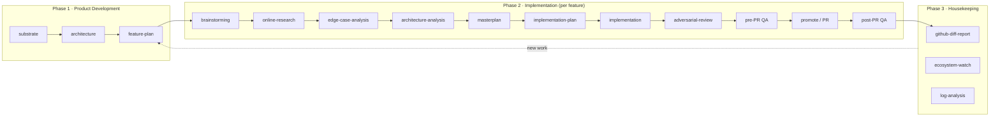

# Agent Playbook

The operating manual for how our agents — and the humans they represent — take a
product idea from concept to shipped, observed, and maintained software.

It is a pipeline of three phases. Work flows left to right, and Phase 3 feeds its
discoveries back into Phase 1.

## The flow



## The three phases

- **Phase 1 — Product Development.** Decide *what* we build and *why*, on top of a
  known *substrate*. Produces the living architecture, the substrate contract, and
  the prioritized feature plan. Home of the standing agents.
- **Phase 2 — Implementation.** Take one feature from the plan through discovery,
  build, review, QA, and pull request. Produces per-feature artifacts and shipped code.
- **Phase 3 — Housekeeping.** Observe what shipped — diffs, logs, and the outside
  world — and turn findings into the next round of work.

## Two kinds of agents

- **Human twin** (`rodin-twin`) — the artificial stand-in for Rodin Lie. It carries
  his priorities, red lines, and sign-off authority so that judgment is available even
  when he isn't at the keyboard. **Self-authored**: Rodin owns and maintains it.
- **AI roles** (`architect`, `product-strategist`, `test-strategist`,
  `deployment-strategist`, `ux-strategist`, plus the Phase 2 pipeline roles) —
  specialist personas with a fixed mission, defined inputs/outputs, and a place in the flow.

## Runtime

How agents *execute* — sandbox (`e2b`), harness (`claude-code`, switchable to `pi`),
and per-role models — is configuration, not process: defaults in
`runtime/factory.defaults.yaml`, project overrides in `factory.config.yaml`, secrets in
`.env` (never committed). Design and rationale: [`runtime-plan.md`](runtime-plan.md).

## Conventions

- **Casing.** Folders and files are `kebab-case`. The human twin lives in `rodin-twin.md`.
- **Frontmatter.** Every agent doc opens with YAML frontmatter (`id`, `kind`, `phase`,
  `reads`, `writes`, `handoff_to`, `authority`) so the pipeline is machine-navigable.
- **Traceability.** Every artifact links back to the one before it. A feature's
  `implementation.md` cites its `architecture-analysis.md`, which cites its
  `edge-case-analysis.md`, back to the `feature-plan` entry that spawned it.
- **One feature = one folder.** Copy `phase-2-implementation/features/_template/` to
  `phase-2-implementation/features/<feature-slug>/` to start a feature.
- **Ask before the irreversible.** Agents never push to `main`, force-push, open a PR,
  or touch production data without an explicit human sign-off. See each pipeline role's
  *Guardrails*.

## Frontmatter schema

```yaml
---
id: architect              # unique slug, matches filename
kind: ai-role              # ai-role | human-twin | pipeline-role | housekeeping-role | artifact
phase: 1                   # 1 | 2 | 3
authority: advisory        # advisory | gate | executor | sign-off | monitor
reads: [substrate.md, feature-plan.md]
writes: [architecture.md]
handoff_to: [product-strategist, senior-developer]
---
```

## Glossary

- **Substrate** — the foundation features are built on: stack, shared services, data
  model, and non-negotiable conventions. See [`substrate.md`](phase-1-product-development/substrate.md).
- **Twin** — an artificial representation of a specific human's judgment.
- **AI role** — a task-specialist agent persona.
- **Gate** — a checkpoint that must pass before work advances (adversarial review, QA).
- **Artifact** — a document produced *by* the flow (per-feature analysis, plans),
  as opposed to the agent docs that *drive* it.
