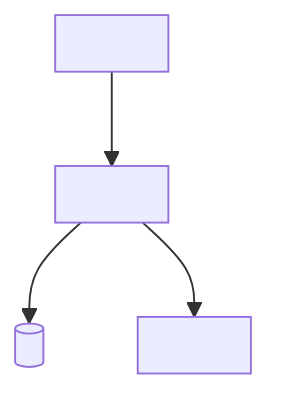

# Architecture

> The living picture of the system: what the pieces are, how they talk, and the
> decisions that got us here. Updated whenever a shipped feature changes the shape of
> the system. Owned by `architect`.

_Last updated: `<yyyy-mm-dd>`_

## 1. System overview

One paragraph: what this system is and the shape of it. Follow with a diagram.

## 2. Components & boundaries

| Component | Responsibility | Owns (data/state) | Talks to |
| --- | --- | --- | --- |
| `<name>` | `<one line>` | `<...>` | `<...>` |

Each component should have **one** reason to change. Note the boundaries that must not
be crossed (e.g. "the web tier never queries the DB directly").

## 3. Key data flows

Walk the 2–3 flows that matter most (e.g. request lifecycle, auth, a core write path).
A short numbered list or a sequence diagram each.

## 4. Cross-cutting concerns

How the system handles the things that touch everything: auth, error handling,
observability, caching, background jobs, migrations. Link to `substrate.md` rather than
repeating it.

## 5. Architecture Decision Records (ADRs)

Append-only. Each entry is a decision we don't want to relitigate — including any
approved exceptions to `substrate.md`.

### ADR-000 · Template
- **Date:** `<yyyy-mm-dd>`
- **Status:** proposed | accepted | superseded by ADR-NNN
- **Context:** what forced a decision.
- **Decision:** what we chose.
- **Consequences:** what this makes easy, what it makes hard.
- **Signed off:** `<twin/role>`
