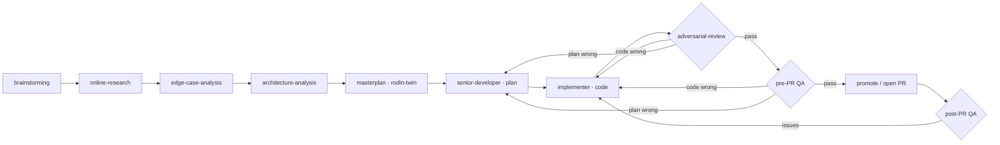

# Phase 2 · Implementation

Take **one** Ready feature from the plan and drive it through discovery, build, review,
QA, and pull request. Everything about one feature lives in one folder.

## The pipeline

### Discovery (the AI roles author these into the feature folder)
1. **`brainstorming.md`** — shape the solution space. Author: `product-strategist` + `ux-strategist`.
2. **`online-research.md`** — how others solved this; libraries, prior art, pitfalls. Author: any role.
3. **`edge-case-analysis.md`** — failure modes and boundaries. Author: `test-strategist` + `ux-strategist`.
4. **`architecture-analysis.md`** — how it fits the system and ships. Author: `architect` + `deployment-strategist`.

### Build & ship (the pipeline roles)
5. **`masterplan.md`** — **one per feature**, in the feature folder. When discovery is
   complete, the requester's human-twin (`rodin-twin`) synthesizes it into the build
   instruction: what this build must deliver, its key constraints, the build order
   within the feature. An artifact, not a role; the senior-developer consumes it.
   Cross-feature order and shared work live in `feature-plan.md` (**Depends on** /
   **Shared work needed**), not here.
6. **`senior-developer.md`** → chooses *which* code changes and *why* → `implementation-plan.md`.
7. **`implementer.md`** → executes the plan: writes `implementation.md` and the code.
8. **`adversarial-reviewer.md`** → tries to break it. Gate (fail → back to implementer).
9. **`pre-pull-request-qa.md`** → verifies acceptance criteria. Gate (fail → back to implementer).
10. **`promoter.md`** → opens the PR (with human sign-off) and shepherds it.
11. **`post-pull-request-qa.md`** → confirms health after merge; hands off to Phase 3.

**Fail routing (both gates):** a failed check goes back to whoever owns the mistake —
**the code is wrong → `implementer`; the plan is wrong or incomplete → `senior-developer`**
(an untestable acceptance criterion → `test-strategist`). The gate states which, per finding.

## Roles vs artifacts

- The files at this level (`senior-developer.md`, `adversarial-reviewer.md`, …) are
  **role docs** — how each agent behaves. They are stable.
- The files inside `features/<slug>/` are **artifacts** — the outputs for one feature.
  Start them by copying [`features/_template/`](features/_template/).

## Definition of Done (gate out of Phase 2)

- [ ] Acceptance criteria from `edge-case-analysis.md` pass (`pre-PR QA`).
- [ ] Adversarial review found nothing unaddressed.
- [ ] Tests exist per the test plan and are green.
- [ ] Rollout + rollback path from `architecture-analysis.md` is in the PR.
- [ ] Rodin (or `rodin-twin` within its mandate) signed off on the PR.
- [ ] Observability contract is live so Phase 3 can watch it.

## A note on `senior-developer`: doc or skill?

Keep the **standard** here as the source of record (`senior-developer.md`). When the
build procedure stabilizes, package the *executable* version as a Claude Code **skill**
under `.claude/skills/` that references this doc. Doc = what "good" means; skill =
the repeatable procedure. See the file for details.
