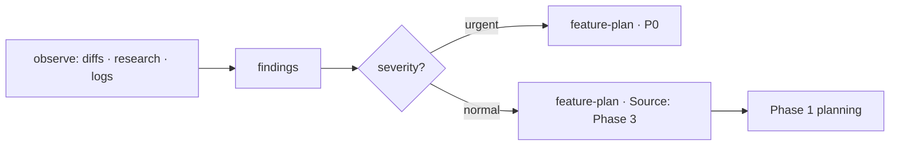

# Phase 3 · Housekeeping

Observe what shipped, keep the system healthy, and turn what we learn into the next round
of work. This is the phase that closes the loop back to Phase 1.

## Roles

| File | Watches | Turns into |
| --- | --- | --- |
| [`github-diff-report.md`](github-diff-report.md) | What actually changed in the repo over a period. | Awareness, drift/debt findings. |
| [`ecosystem-watch.md`](ecosystem-watch.md) | The outside world — deps, CVEs, ecosystem moves. | Upgrade/adopt/mitigate items. |
| [`log-analysis/frontend.md`](log-analysis/frontend.md) | Client errors, performance, real user pain. | Bug + UX findings. |
| [`log-analysis/apis.md`](log-analysis/apis.md) | API errors, latency, throughput, contracts. | Reliability + perf findings. |
| [`log-analysis/database.md`](log-analysis/database.md) | Slow queries, locks, growth, integrity. | Performance + data findings. |

## The loop

## How findings flow back

Every housekeeping finding worth acting on becomes a `feature-plan.md` entry tagged
**Source: Phase 3**, with the evidence (log query, diff link, advisory) attached. Urgent
issues (active incident, security) are raised as **P0** immediately and routed straight to
Phase 2, not parked in the backlog.

## Cadence

Set a rhythm so housekeeping isn't only reactive. Suggested default:
- **Per merge:** `post-pull-request-qa` hands the watch list here.
- **Weekly:** diff report + a log-analysis sweep across frontend/apis/database.
- **Monthly:** dependency/security research pass.

## Guardrails

Phase 3 is **observe-and-report**. Reading logs, diffs, and advisories is safe; acting on
them (patching, deploying, rolling back, deleting data) goes through the normal flow with
human sign-off. Never put customer data, secrets, or PII into a finding — link to the
source instead.
