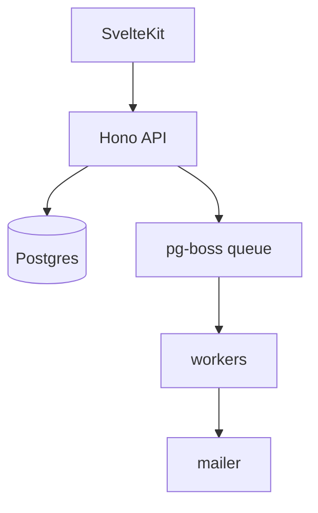

# Architecture

_Last updated: 2026-09-04_

## 1. System overview
A SvelteKit app talks to a Hono API over REST; the API owns Postgres and a pg-boss
queue; workers consume the queue for e-mail and reminders.

## 2. Components & boundaries
| Component | Responsibility | Owns (data/state) | Talks to |
| --- | --- | --- | --- |
| `web` | UI, session | nothing | `api` |
| `api` | domain rules, auth | Postgres | `queue` |
| `workers` | async jobs | job state | `mailer` |

The web tier never queries the DB directly.

## 3. Key data flows
1. Booking write: web → api validates overlap → insert → enqueue confirmation.
2. Login: web → Vipps OIDC → api session cookie.

## 4. Cross-cutting concerns
See `substrate.md` §4. Auth middleware on every route; pino request logs; migrations via Drizzle.

## 5. Architecture Decision Records (ADRs)

### ADR-0001 · Adopt the agent factory
- **Date:** 2026-08-12
- **Status:** accepted
- **Context:** one operator, many features.
- **Decision:** run the three-phase playbook with human gates.
- **Consequences:** every feature leaves an artifact trail.
- **Signed off:** rodin-twin

### ADR-0005 · pg-boss for the job queue
- **Date:** 2026-08-20
- **Status:** accepted
- **Context:** reminders and e-mails need retries.
- **Decision:** pg-boss on the existing Postgres, no new infra.
- **Consequences:** one database to operate; throughput capped by Postgres.
- **Signed off:** operator

### ADR-0007 · nodemailer as the SMTP client (F-006)
- **Date:** 2026-09-05
- **Status:** proposed
- **Context:** e-mail notifications need an SMTP client; red line: no new dependency without an ADR.
- **Decision:** nodemailer, pinned major, MIT. Alternative: raw SMTP over `net` — more code to own.
- **Consequences:** one well-known dependency; transitive surface reviewed.
- **Signed off:** pending — operator
