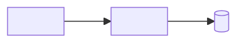

# Architecture Analysis — `e-mail notify`

> How this feature fits the system, and how it will ship safely. The last doc before code.
> Cross-check against `substrate.md` and `architecture.md`.

## Change surface
What components, data, and contracts does this touch? A small diagram if it helps.

## Substrate check
- Respects `substrate.md` non-negotiables? **Yes / No.**
- If **No**: link the ADR in `architecture.md` and the sign-off. No silent exceptions.

## Design decisions
The choices worth recording, each with the alternative rejected and why.
- `<decision>` → chosen over `<alt>` because `<...>`

## Data & migrations
Schema changes, migration order, and how each migration is reversible independently of
the code deploy.

## Rollout plan
- **Strategy:** flag / canary / phased / straight — and why.
- **Sequence:** the safe order of steps.
- **Rollback:** the exact way back, and the trigger ("if X, revert").

## Observability contract
What must be emitted to know this is healthy — the signals Phase 3 will watch.
- **Logs:** `<events, fields — no PII>`
- **Metrics:** `<names + what healthy looks like>`
- **Traces / alerts:** `<...>`

## Risks
Blast radius and the top things that could go wrong on ship.
